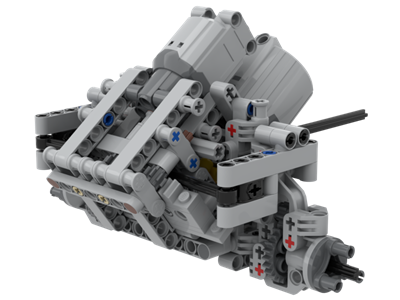

# 🇵🇱

| Parametr | Wartość |
| ---- | ---- |
| Autor oryginału | **Atros** |
| Zmodyfikowany przez | **Zozoleon** |
| Rodzaj zawieszenia | **Pływające na ośkach 12** |
| Silniki napędowe | **PF XL** |
| Przełożenie napędu | **3:1 (w tym 3:1 w zwolnicach)** |
| Silnik skrętu | **PF L** |
| Szerokość w felgach | **202mm (25s)** |
| Waga (bez silników) | **152g** |
| Kompatybilne opony | **Tamiya CC01, 94.8x44R, 94.3x38R, 107x44R** |

Ten most ukazał się na przełomie 2018 i 2019 roku, chodź jego pierwsze wersje z silnikiem NXT pochodzą jeszcze z 2016 roku. W oczy od razu rzuca się nietypowa geometria - środkowa część mostu zawierająca układ skrętny i napędowy ułożona jest pod kątem 37 stopni. Taka budowa zapewnia bardzo dobre kąty natarcia i zejścia mostu &#8211; silnik napędowy nie wystaje za obrys kół a listwa skrętu nie zawadza przy najazdach na progi. Most używa jednoelementowych zwolnic.

Plusy:
- Bardzo dobre kąty natarcia i zejścia
- Proste przeniesienie napędu - tylko para knobów
- Łatwy demontaż silników i zwolnic

Minusy:
- Dość delikatna i skomplikowana konstrukcja (ale nie awaryjna!)
- Bardzo szybkie przełożenie skrętu (i jego mała siła)
- Trudny montaż do ramy: należy mocno zabiezpieczyć ośki i dodać cięgna lub punkt obrotu z przodu